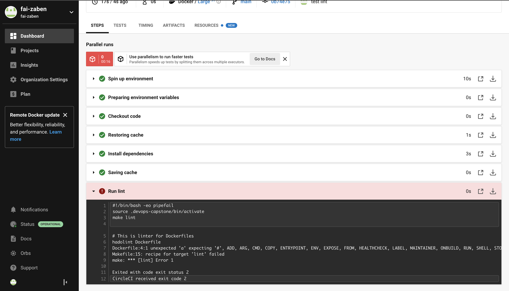
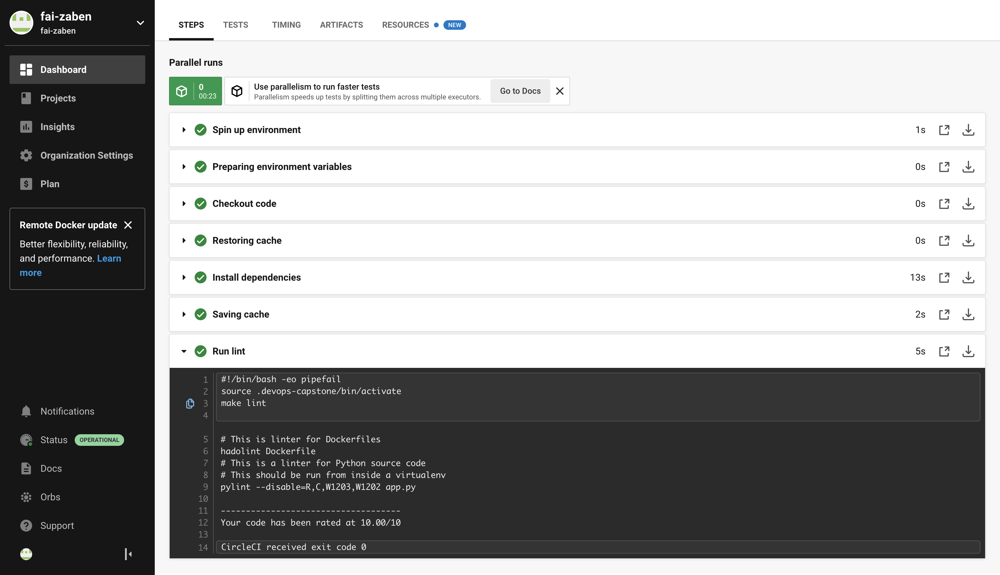
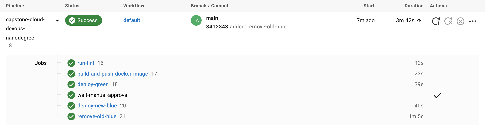
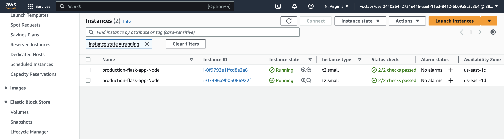
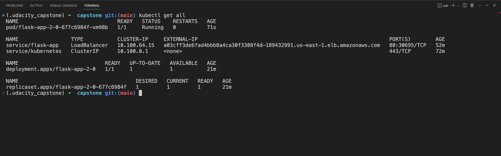
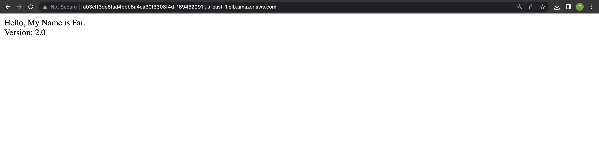

# capstone-cloud-devops-nanodegree

### Tools used in this project:

CircleCI
AWS 
aws-cli
Python3, Flask framework, pip3
Docker 
DockerHub
Kubernetes cli (kubectl)
AWS EKS

#### Code is checked against a linter:

#### All stages passed successfully

#### AWS EC2 page showing the newly created instances

#### kubectl command output showing that the deployment is successful, pods are running, and the service can be accessed via an external IP or port forwarding

#### we can access the application after deployment

